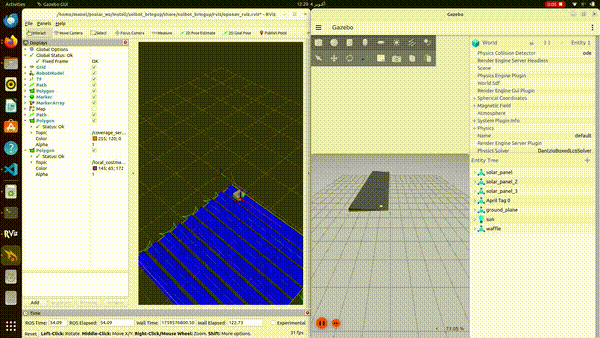

# 🌞 Autonomous Solar Panel Cleaning Robot

---

## Table of Contents
- [Overview](#overview)
- [Features](#features)
- [Project Structure](#project-structure)
- [Getting Started](#getting-started)
- [Conclusions & Perspectives](#conclusions--perspectives)

---

## 🤖 Overview
Simulation of an autonomous robot for cleaning solar panels, built in ROS2 Humble with C++. Designed for precise navigation, coverage path planning, and mission execution.



---

## 🛠 Features

- Gazebo Simulation: Full robot simulation to test navigation and cleaning operations
- Localization & Sensor Fusion:
  - GPS/IMU/Encoder fusion using Extended Kalman Filter (EKF)
  - Odometry correction for accurate localization on sloped surfaces
- Coverage Path Planning:
  - Integrated \`opennav_coverage\` for robust area coverage
  - Zigzag planner plugin for Nav2 as a lightweight alternative
- Mission Execution:
  - Behavior Trees to coordinate cleaning, navigation, and docking
  - Simulated battery management using a linear discharge model

---

## 📂 Project Structure


Autonomous-Solar-Panels-Cleaning-Robot/
├── README.md
├── assets/
│ └── demo.gif
└── src/
├── Fields2Cover/
│ ├── tutorials/
│ └── swig/
│ └── python/
├── localization_pipeline.drawio
├── opennav_coverage/
│ ├── opennav_coverage/
│ ├── opennav_coverage_msgs/
│ ├── opennav_coverage_navigator/
│ ├── backported_bt_navigator/
│ └── opennav_row_coverage/
├── solbot_bringup/
├── solbot_decision_making/
├── solbot_docking/
├── solbot_gazebo/
├── solbot_localization/
└── solbot_navigation/

---

## 🚀 Getting Started

1. **Clone the repository**
```bash
git clone https://github.com/Mmanell/Autonomous-Solar-Panels-Cleaning-Robot.git
cd Autonomous-Solar-Panels-Cleaning-Robot
```

2. **Launch Simulation**
```bash
ros2 launch solbot_bringup solbot.launch.py
```

3. **Launch Navigation Stacks**
```bash
ros2 launch solbot_navigation navigate_between_panels.launch.py
ros2 launch solbot_navigation complete_coverage.launch.py
```

4. **Launch Docking**
```bash
ros2 launch solbot_docking apriltag_dock_pose_publisher.launch.py
```

5. **Execute the Mission**
```bash
ros2 run solbot_decision_making mission_bt
```

---

## ✅ Conclusions & Perspectives

Conclusions:
- Successfully simulated a solar panel cleaning robot with autonomous coverage and docking
- Achieved 100% field coverage with \`opennav_coverage\`
- Implemented EKF-based sensor fusion (GPS/IMU/Encoder) for accurate localization on sloped surfaces
- Demonstrated modular mission logic in ROS2, including battery monitoring, field selection, and coordinated navigation

Perspectives / Future Work:
- 🔄 Dynamic switching between navigation stacks to optimize performance based on environment or task
- ⚡ Full integration of the lightweight zigzag planner into the mission pipeline for real-time coverage
- 🤖 Hardware deployment: porting the simulation to a real solar panel cleaning robot with real-time telemetry and GPS RTK
- 🛠️ Improve docking procedure to ensure reliable autonomous docking under different conditions
- 🧠 Intelligent fault detection: incorporate ML-based monitoring for predictive maintenance and autonomous recovery

